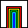
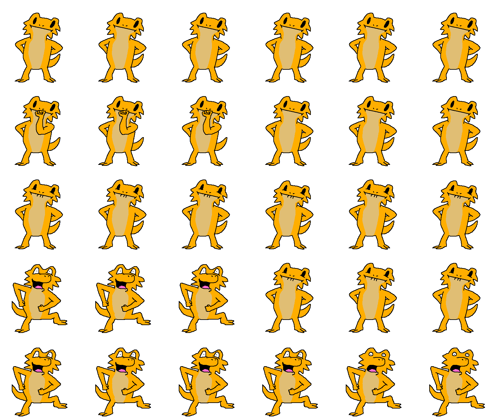

# pi.exe 
*A cursed app starring a certain farting lizard.*

The main attraction of this repository is the MP4 file titled with yesterday's date.  It tells a story where the cursed app appears on my desktop uninvited, and after summoning the courage, I start recording with OBS and run pi.exe.

**[Latest video edit](2021-02-04%22-14-21.mp4)**

Inspired by old screen savers with characters running around the desktop, I made an app where a polite pogona appears and patiently waits to be clicked on.

And then he farts.

Including two (2) meme farts.

 **[pi.exe](pi.exe)** is available to download, but I would recommend watching the video for the same experience.

> (If for some reason you download pi.exe and run it, please note you can end the program with the Escape Key or the X via the toolbar.  Since the app has no window border, there are no buttons for closing, minimizing, etc.  Also be warned the Escape Key will trigger the worst meme fart before the program closes.)

This was a fun exercise for both art and coding.  I enjoyed drawing the pogona again and making him animated, even though the animation is very limited.  I even included the [paint.NET project file](Art/Sprite%Project.pdn) which has each unique frame as layers.  As for code, I decided to reuse most of the scripts from **[Endless Trash](https://github.com/Xatro/EndlessTrash)** as well as a couple of small scripts from Messiah Quest II.  In fact, Endless Trash is mostly simplified scripts from Messiah Quest II, as they use nearly the same methods for drawing images on a window.  Pi.exe is for the most part the same concept as Endless Trash: a program to play an animation to be recorded.  That is why I ultimately decided to reuse Endless Trash and make small edits to work for pi.exe.  The biggest change is to the main form where instead of playing a movie, it controls the Lizard State Machine.  As for the inclusion of the Messiah Quest II code, I wanted the executable file to be able to run anywhere to complete its cursed illusion, so I used the same methods for loading embedded files in the exe.

###### (Messiah Quest II is just this other thing I'm working on...)

Anyway I hope you enjoy the video and my obtuse methods of making it!  I don't have animation or video editing software or experience, but is what I do have is experience with C# and Windows Forms.  If it seems weird, it's probably because it's weird.
